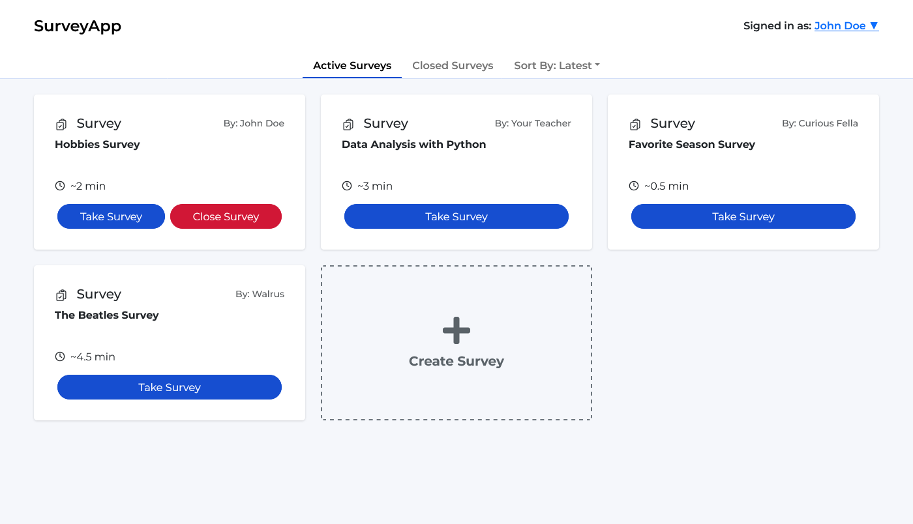
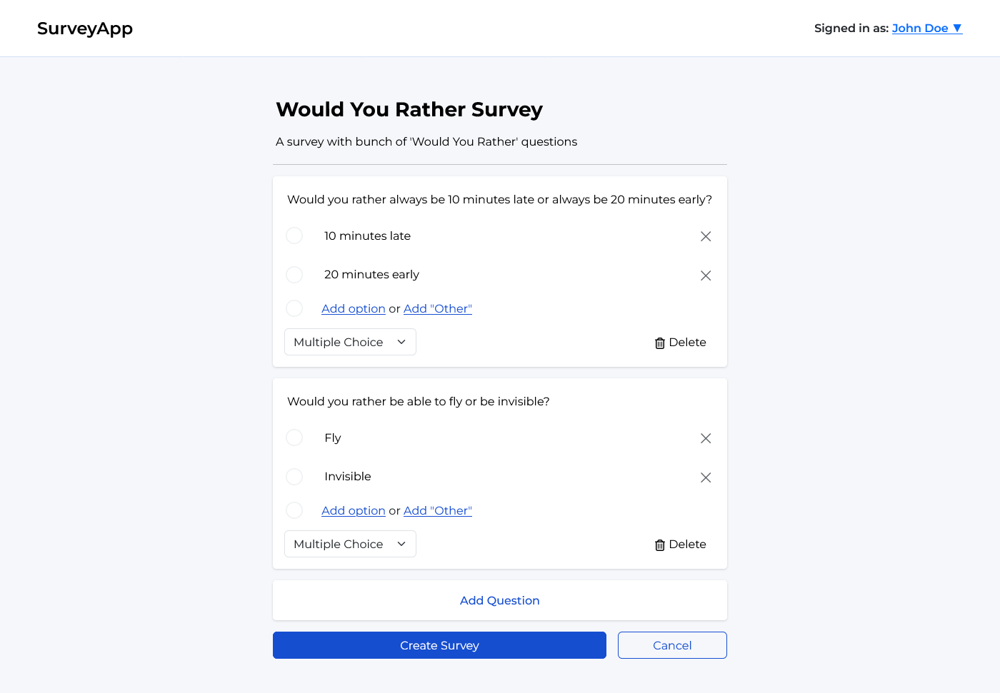
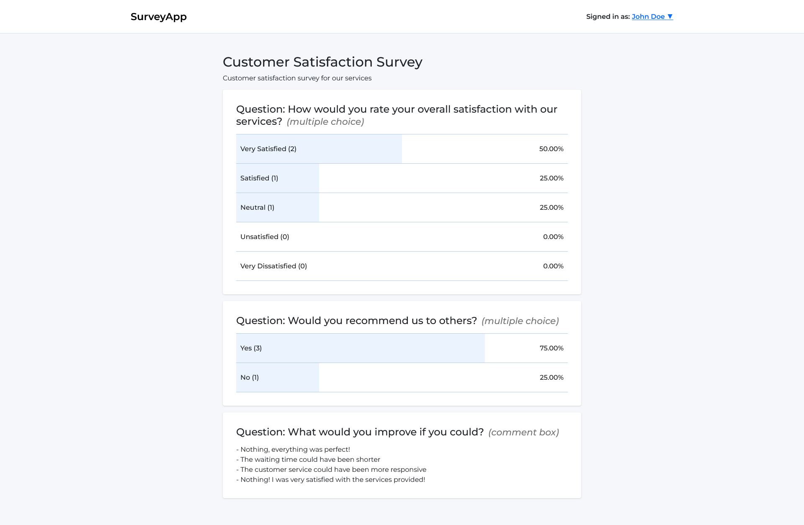

# Survey App - Full Stack Web Development Project

## Overview

A full stack web application for creating, answering and managing surveys. Developed as part of the University of Helsinki full stack web development project course.

A live demo of the application can be found here: [https://fs-survey-app.fly.dev](https://fs-survey-app.fly.dev)

## Features

- User authentication (sign up, log in, account management)
- Create, respond to, close and delete surveys
- Multiple question types: multiple choice, checkbox, comment box
- View survey results summary
- Sorting surveys (latest, name, time)

## Tech stack

- **Frontend:** React, Redux, CSS
- **Backend:** Node.js, Express, REST API
- **Database:** MongoDB
- **Testing:** Robot Framework

## How to use

To clone and run this application, you'll need [Git](https://git-scm.com/) and [Node.js](https://nodejs.org/) (which comes with [npm](https://www.npmjs.com/)) installed on your computer. From your terminal:

```
# Clone this repository
$ git clone https://github.com/jarkmaen/fs-survey-app.git

# Go into the project directory
$ cd fs-survey-app

# Install dependencies in the backend
$ cd survey-app-backend
$ npm install

# Install dependencies in the frontend
$ cd ../survey-app-frontend
$ npm install

# Create a .env file in the backend directory with the following:
JWT_SECRET=<your_secret>
MONGODB_URI=<your_mongodb_uri>
PORT=3001

# Start the backend
$ npm start

# In another terminal, start the frontend
$ cd survey-app-frontend
$ npm run dev
```

Once both are running, open http://localhost:5173 in your browser.

## Screenshots

| Home page                         | Creating a survey                              | Viewing results                                  |
| --------------------------------- | ---------------------------------------------- | ------------------------------------------------ |
|  |  |  |

## Documentation

- [Testing](documentation/testing.md)
- [User guide](documentation/user-guide.md)
- [Work hours / dev log](documentation/development-log.md)
