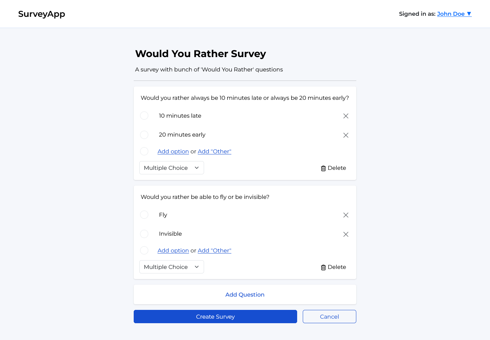

# User instructions

## Using the application and its features

1. **Account creation and logging in**

    - **Log in**

        - Click the "Log in or Sign up" button in the top right corner of the website.
        - You will be taken to the login page.
        - Enter your username and password.
        - Click "Log in" to access your account.

    - **Sign up**

        - If you don't have an account, click the "Sign up" link at the bottom of the login form.
        - Fill in your name, username and password.
        - Click "Sign up" to create your account.

2. **Creating a survey**

    - After logging in you can create a survey by pressing the "Create Survey" button that is at the end of the survey listing page.
    - Fill in the survey title and description.
    - Add questions by setting the question title and options.
    - To add more options for a question press the "Add Option" button.
    - You can also add an "Other" option which allows respondents to provide a custom answer.
    - Set the question type from the dropdown menu:
        - **Multiple Choice**: Respondents can select one option from a list.
        - **Comment Box**: Respondents can provide a free-text answer.
        - **Checkbox**: Respondents can select multiple options from a list.
    - Click the "Add Question" button to add another question.
    - When you are done, press the "Create Survey" button to publish your survey.

3. **Viewing surveys**

    - Navigate to the home page to see a list of all surveys.
    - Surveys are categorized into two tabs: "Active Surveys" and "Closed Surveys".
    - **Active Surveys**: Click the "Active Surveys" tab to view surveys that are currently open for responses. Click the "Take Survey" button to view its questions and options.
    - **Closed Surveys**: Click the "Closed Surveys" tab to view surveys that have ended and won't receive any new responses. You can only view the results of closed surveys. Click "View Results" to see all the responses to that survey.
    - You can also sort the surveys by latest, name or time using the dropdown menu.

4. **Responding to a survey**

    - Select a survey from the list under the "Active Surveys" tab.
    - Answer the questions and submit your response.

5. **Closing and deleting a aurvey**

    - **Closing a survey**:
        - Navigate to the "Active Surveys" tab.
        - Click the "Close Survey" button on the survey you want to close.
        - The survey will move to the "Closed Surveys" tab.
    - **Deleting a survey**:
        - You can delete a survey directly from the survey viewing list by clicking the "Delete Survey" button.
        - You can also click "View Results" to see the survey responses, scroll down, and click the "Delete Survey" button at the bottom of the results page.

6. **Managing your account**
    - After logging in, in the top right corner you have a dropdown menu where you can go to your account settings page or log out.
    - In the account settings page you can do the following:
        - **Change your account name**: Update your name by entering a new name and clicking the "Update Name" button.
        - **View your created surveys**: View a list of surveys you have created.
        - **Delete your account**: Delete your account along with all the surveys you have created by clicking the "Delete Account" button.

## Screenshots

| Home page                         | Creating a survey                              | Responding to a survey                             |
| --------------------------------- | ---------------------------------------------- | -------------------------------------------------- |
|  |  |  |

| Survey results 1                                 | Survey results 2                                 | Account settings                                 |
| ------------------------------------------------ | ------------------------------------------------ | ------------------------------------------------ |
|  |  |  |
