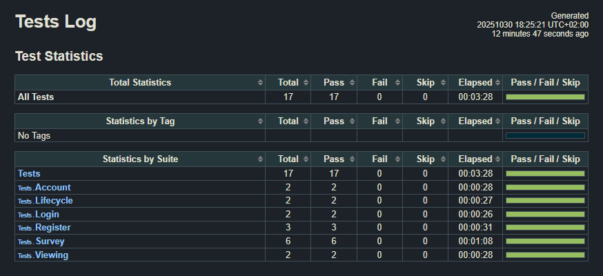

# Testing

The application was tested using Robot Framework and SeleniumLibrary.

## End-to-end (E2E) testing

There are 17 E2E test cases in total to make sure the entire application works correctly from a user's perspective.

### Account management (account.robot)

- Deleting an account
- Updating account name

### Survey creation and management (survey.robot, viewing.robot)

- Adding and removing options
- Adding and removing questions
- Closing surveys
- Creating surveys with different question types (Multiple Choice, Checkbox, Comment Box)
- Deleting surveys
- Sorting surveys by latest, name and time
- Validating submitted form
- Viewing active and closed surveys

### Survey lifecycle (lifecycle.robot)

- Completing the full flow of creating, responding, viewing results and deleting
- Removing all surveys created by a deleted account

### User authentication (login.robot, register.robot)

- Logging in with correct credentials
- Registering a new user with validation

## Running the tests

To run the following commands below, you'll need to have [Python](https://www.python.org/) installed on your computer. From your terminal:

```
# Create a virtual environment
$ python -m venv venv

# Activate the virtual environment
$ source venv/bin/activate

# Install dependencies
$ pip install robotframework robotframework-requests robotframework-seleniumlibrary
```

Before running the tests, make sure both the backend and the frontend are running. Instructions for starting the application can be found in the [How to use](../README.md#how-to-use) section of the README.

Once both are running, run the tests:

```
$ robot --outputdir tests/results tests
```

The test results are generated in the tests/results/ directory as log.html and report.html. Below is an example of the log.html output:


