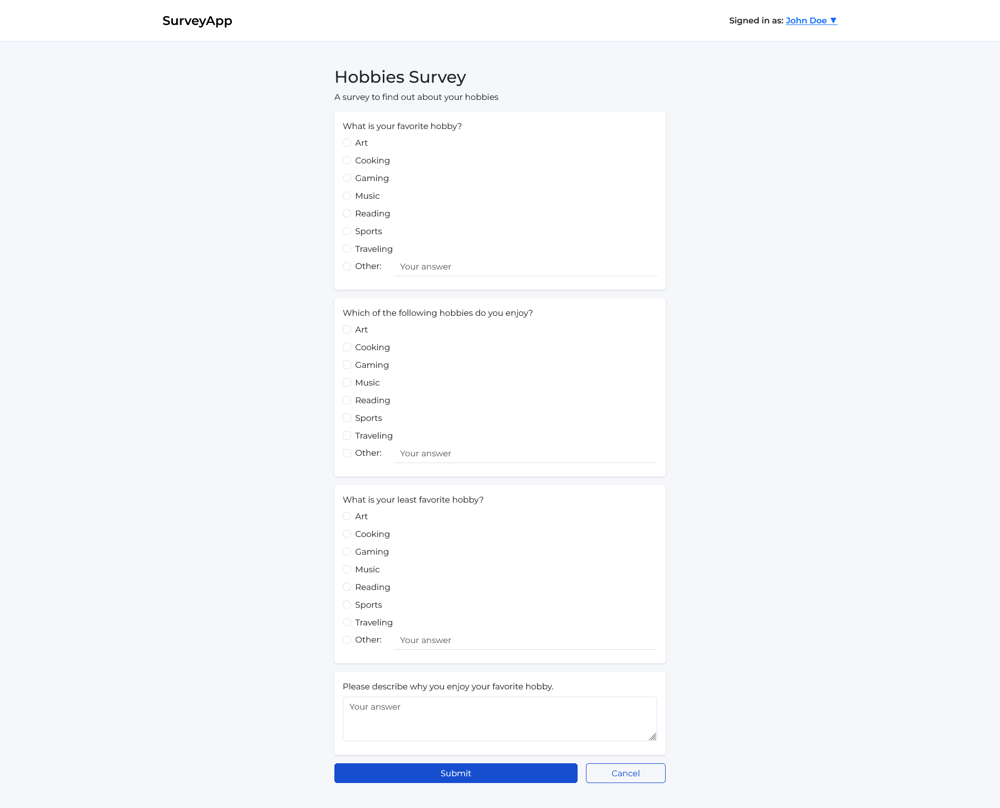
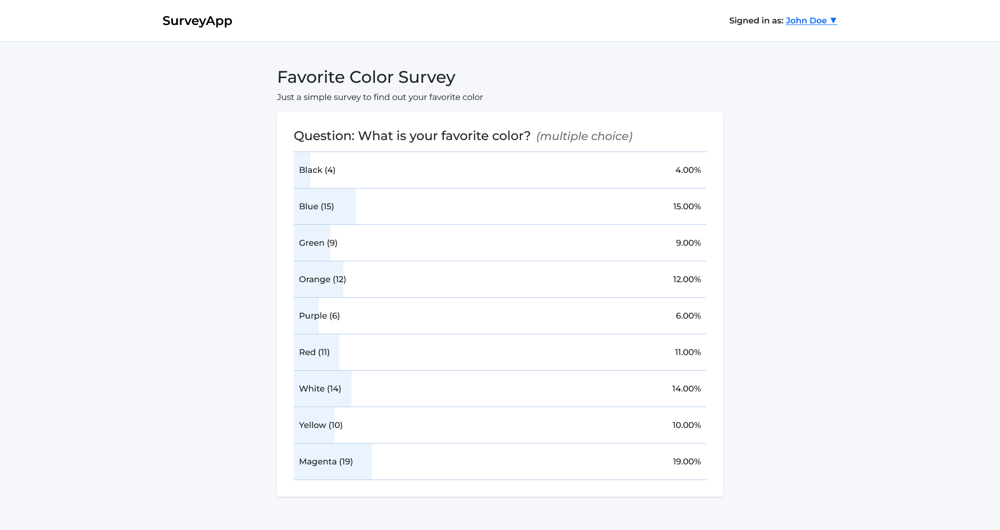
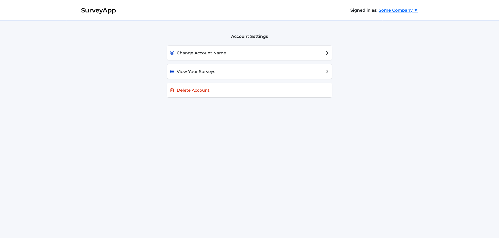

# User guide

## Account management

### Signing up

- Click the "Log in or Sign up" button in the top right corner.
- Click the "Sign up" link at the bottom of the login form.
- Fill in your name, username and password.
- Click the "Sign up" button to create your account.

### Logging in

- Click the "Log in or Sign up" button in the top right corner.
- Enter your username and password.
- Click the "Log in" button to access your account.

### Managing your account

- Click your username in the top right corner and select "Account Settings" from the dropdown menu.
- From the settings page you can:
    - Update your name by entering a new name and clicking the "Update Name" button.
    - View a list of all your created surveys.
    - Delete your account and all associated surveys by clicking the "Delete Account" button.

## Creating surveys

1. Click the "Create Survey" button at the bottom of the survey listing page.
2. Fill in the survey title and description.
3. Click the "Add Question" button to add as many questions as you like.
4. For each question:
    - Enter the question title.
    - Select the question type from the dropdown menu:
        - **Checkbox**: Respondents can select multiple options.
        - **Comment Box**: Respondents can freely write their response.
        - **Multiple Choice**: Respondents can select only one option.
    - Click the "Add Option" text to add as many options as you like.
    - You can also enable the "Other" option to allow custom text responses.
5. Once you have added all your questions, click the "Create Survey" button at the bottom to publish.

## Viewing and responding to surveys

- On the home page you can see a list of all the surveys.
- Surveys are categorized into two tabs:
    - **Active Surveys**: Displays surveys currently open for responses. Click the "Take Survey" button to participate and submit your answers.
    - **Closed Surveys**: Displays surveys that have ended. You cannot submit new responses here, but you can click the "View Results" button to see the results.
- You can also use the dropdown menu to sort surveys by latest, name or time.

## Closing and deleting surveys

### Closing a survey

- Navigate to the "Active Surveys" tab.
- Click the "Close Survey" button on the survey you want to close.
- The survey moves to the "Closed Surveys" tab.

### Deleting a survey

- Before a survey can be deleted, it must first be closed.
- Navigate to the "Closed Surveys" tab.
- Click the "Delete Survey" button on the survey you want to delete.

## Screenshots

| Home page                          | Creating a survey                              | Responding to a survey                             |
| ---------------------------------- | ---------------------------------------------- | -------------------------------------------------- |
|  |  |  |

| Survey results 1                                 | Survey results 2                                 | Account settings                                 |
| ------------------------------------------------ | ------------------------------------------------ | ------------------------------------------------ |
|  |  |  |
